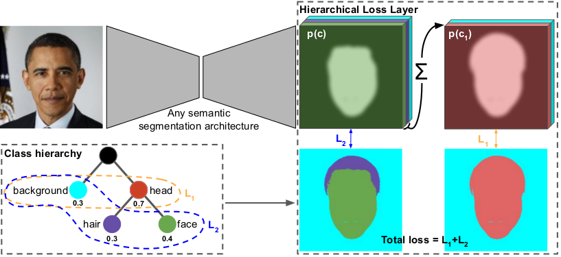
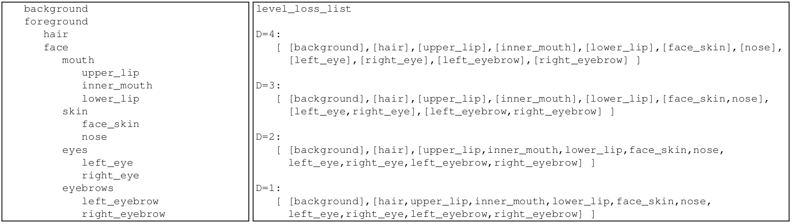
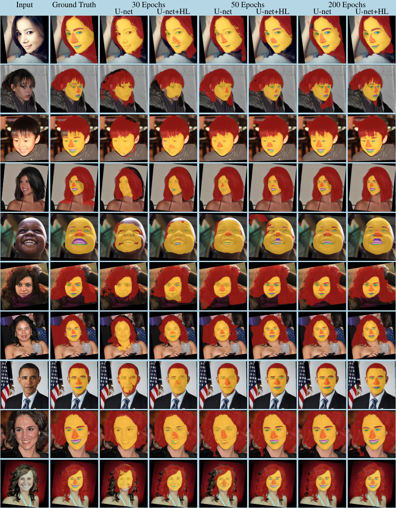
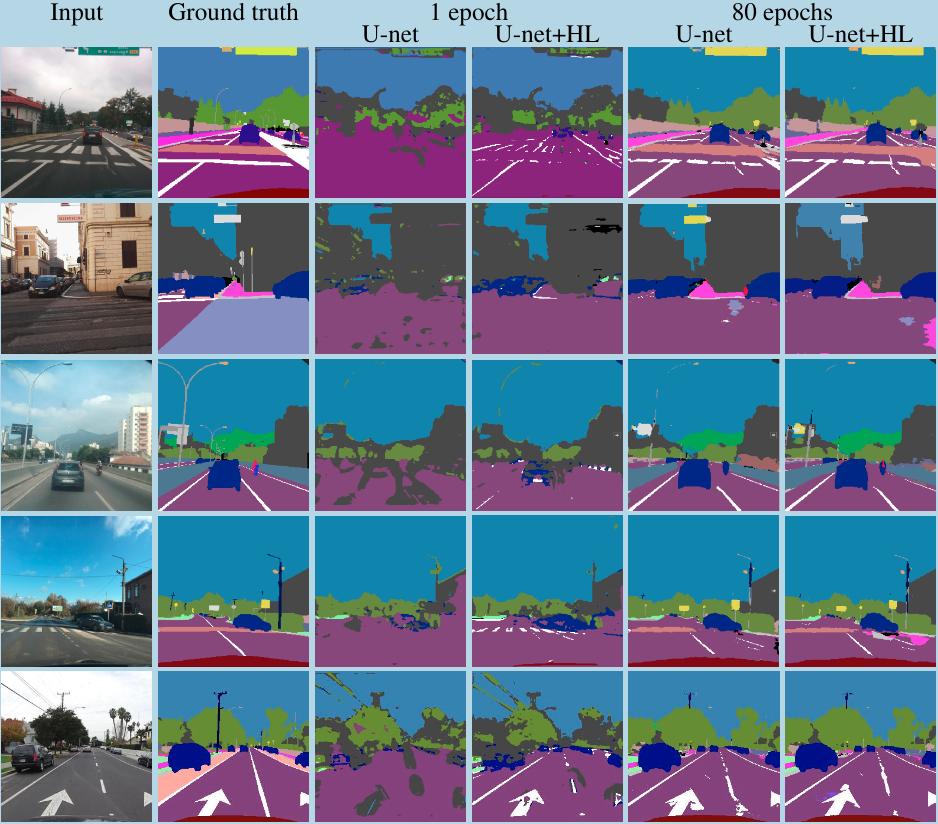

[A Hierarchical Loss For Semantic Segmentation (VISAPP 2020)](http://www.visapp.visigrapp.org/) - [Bruce Muller](https://www.cs.york.ac.uk/cvpr/member/bruce/) and [William Smith](https://www.cs.york.ac.uk/cvpr/member/will/)

### Abstract

We exploit knowledge of class hierarchies to aid the training of semantic segmentation convolutional neural networks. We do not modify the architecture of the network itself, but rather propose to compute a loss that is a summation of classification losses at different levels of class abstraction. This allows the network to differentiate serious errors (the wrong superclass) from minor errors (correct superclass but incorrect finescale class) and to learn visual features that are shared between classes that belong to the same superclass. The method is straightforward to implement (we provide a PyTorch implementation that can be used with any existing semantic segmentation network) and we show that it yields performance improvements (faster convergence, better mean Intersection over Union) relative to training with a flat class hierarchy and the same network architecture. We provide results for the Helen facial and Mapillary Vistas road-scene segmentation datasets.

### Plug and Play Hierarchical Loss

* Our idea is to use the hierarchical structure in the semantics of classes to improve a deep model by a simple Hierarchical Loss Function.

* Given the output of any semantic segmentation architecture and a class hierarchy, we compute losses for each level of abstraction within the hierarchy, inferring probabilities of super-classes from their children (see above figure).

* A particular advantage of this work is its generality and self-contained nature allows the possibility of plugging this hierarchical loss on the end of any deep learning architecture.

* We provide the simple to use hierarchical loss function within loss.py.

* Class hierarchies are defined with a simple tab delimited text file (figure below, left).

* We pre-compute lists of leaf nodes (figure below, right) for each depth corresponding to the summations required for computing internal node probabilities (see paper for more implementation details).

### Results

</img> </img> </img> </img> 

Left: Hierarchical Losses during training for vanilla (U-Net) and hierarchically trained models (U-Net+HL). 
Right: Accuracy (Intersection over Union) during training on a test set. 
Top: Helen facial dataset. 
Bottom: Mapillary Vistas road scene dataset. 
Note: Vanilla (U-Net) and hierarchically trained models (U-Net+HL) receive identical input during training. 

* Our research illustrates the potential of using losses that encourage semantically similar classes within a hierarchy to be classified close together, where the model parameters are guided towards a solution not only better quantitatively, but faster in training than using a standard loss implementation.

* Our hierarchically trained model is significantly benefiting from the hierarchical structure in the semantic class labels, particularly in the early phase of training, learning much faster than the vanilla model. This is shown in the above figures (left) where the losses for each hierarchical level outperforms and accelerates significantly initially.

* Any hierarchical structure can be provided to help train your model.

* Note that the deeper loss for finer classes is always larger than a shallower one as it's the more difficult task.

* The above figures (right) also displays mean IOU during training. Performance gain is most significant around epoch 50 and can be observed in the qualitative results from the below figure.

* Similar improvements are shown for the much more challenging Vistas road scene dataset where the number of classes is over 60 (see Vistas paper and the text file mapillary_tree.txt for the hierarchy we used).

* We also contribute a numerically stable formulation for computing log and softmax of a network output separately, a necessity for summing probabilities according to a hierarchical structure.

* Our experiments use the Helen facial dataset (http://www.ifp.illinois.edu/~vuongle2/helen/ and http://pages.cs.wisc.edu/~lizhang/projects/face-parsing/) and the Mapillary Vistas road scene dataset (https://www.mapillary.com/dataset/vistas?pKey=aFWuj_m4nGoq3-tDz5KAqQ&lat=20&lng=0&z=1.5).

### Try It Yourself

* The main things you need are:
  * The hierarchical loss function (see hierarchical_loss.py) which you are free to augment into your own process.
  * Some way of translating the indented text file into a of integers for input to this loss function. We used some general python which you could use too (see ptsemseg/tree.py).

* Implemented in PyTorch 1.0.0. We used Anaconda 5.2.0 and CUDA 9.0.176. 
* Provide your own intuitive hierarchy unique to your own data (see faces_tree.txt for an example).
* For semantic segmentation your data should usually be integer values for the classes. 

* Note you may need to correct your hierarchical representation within training to hold the correct channels (see train.py the class_lookup list and update_channels function (in ptsemseg/tree.py)): 

* We used U-Net for a simple model for comparison purposes but you are free to use your own.

### Acknowledgements

We would like to thank Meet Shah (https://github.com/meetshah1995/pytorch-semseg) and the contributors there for the great semantic segmentation code base with data loading, model and metric support.

### Reference

Muller, B.R., Smith, W.A.P., 2020. A Hierarchical Loss for Semantic Segmentation. In Proceedings of the 15th International Joint Conference on Computer Vision, Imaging and Computer Graphics Theory and Applications VISAPP 2020. SCITEPRESS.

Please feel free to get in touch if your are interested in our research! (brm512@york.ac.uk)

